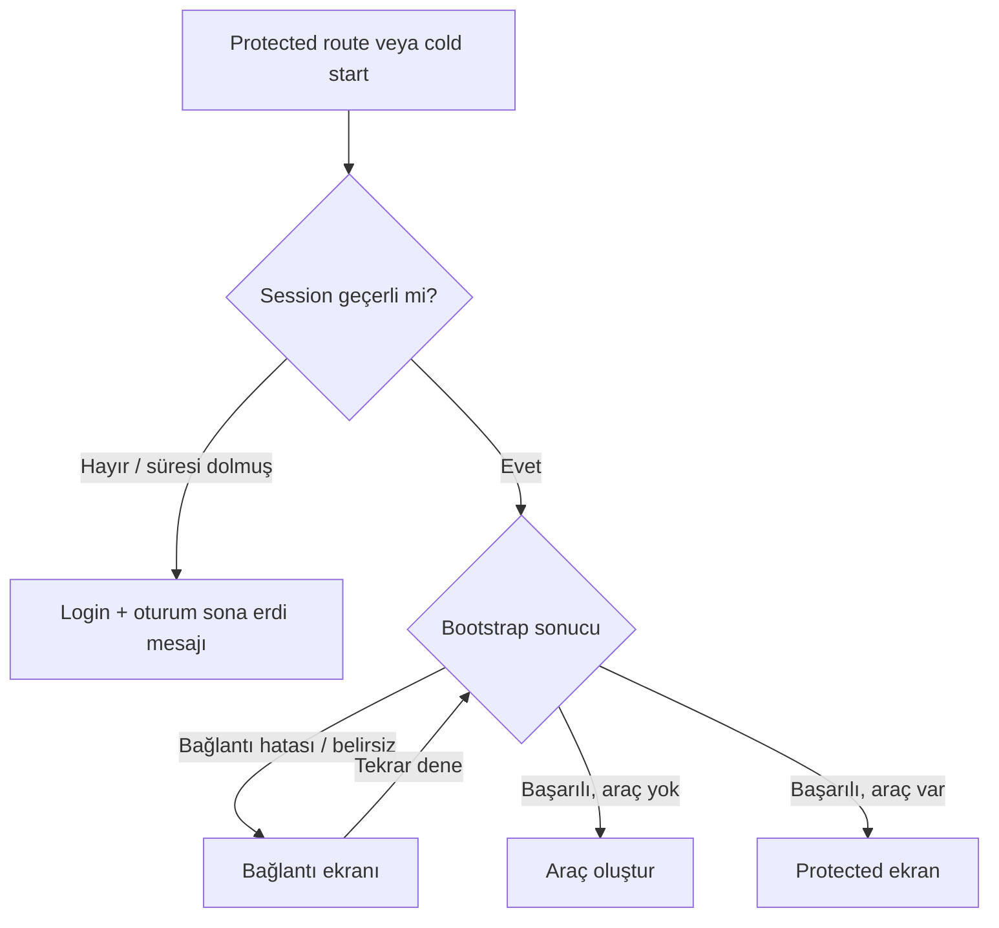
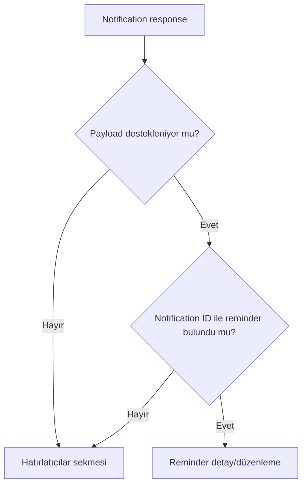
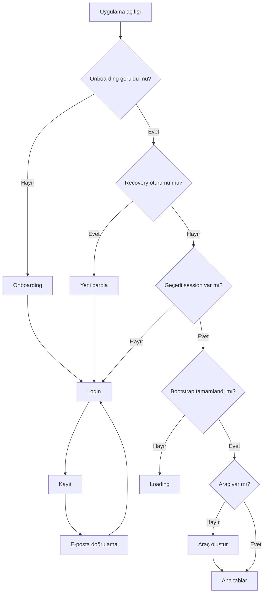
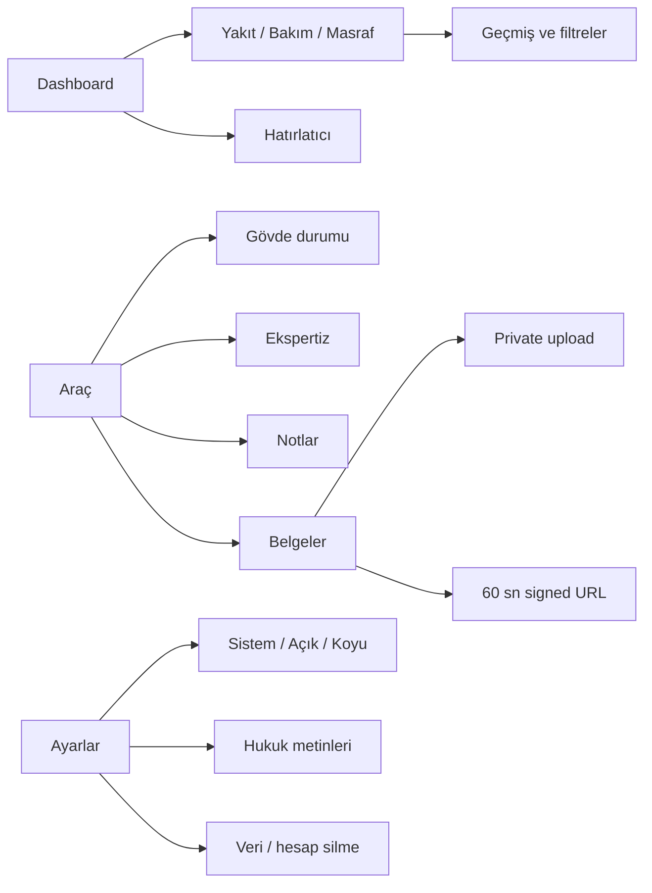
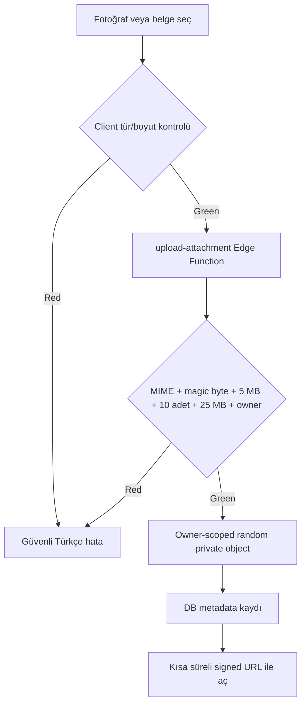

# V1 ana kullanıcı akışı denetimi

## TASK-010 cihaz kabulü sonrası güncelleme — 2026-08-02

- Dashboard hızlı aksiyonları ve history kartları doğrulanmış string route parametreleriyle merkezi
  helper üzerinden `navigate` eder; aktif araç/entity yokluğu güvenli loading/empty state üretir.
- Dashboard, Araç, Hatırlatıcılar ve Gövde ekranları silinmiş/stale active vehicle durumunda `null`
  render etmez. Mutation sonrası araç listesi yeniden çözülür ve silinmiş ID temizlenir.
- Attachment açma kısa ömürlü signed URL üretimi, Android handler ve native open hatalarını tek güvenli
  boundary'de toplar; kullanıcıya provider/path/URL detayı göstermez.
- Reminder kartları tarih ve kilometreyi ayrı değerlendirir. Merkezi eşikler tarih için 30 gün,
  kilometre için 1.000 km'dir; bugün/eşit/aşım durumları ayrı etiketlenir.
- Mevcut tek-notification-ID sözleşmesi nedeniyle V1 lead-time seçimi tek seçimdir: 7, 3, 1, 0 veya
  özel gün; varsayılan 1 gün ve cihaz yerel saatinde 09:00. Tercih PII içermeden cihazda saklanır.
- İlk render yalnız session/araç ve ana veri paketini bekler; attachment/reminder reconciliation
  tutarlılık garantisini koruyarak arka planda çalışır.
- 1–2 Ağustos APK'sında bulunan crash/beyaz ekranlar nedeniyle bunların kaynak düzeltmesi `Passed`
  sayılmaz. Yeni APK için [TASK-010 kabul matrisi](v1-acceptance-test-matrix.md#task-010-android-crash-regression-matrisi--2026-08-02)
  zorunludur.

**Audit date:** 2026-08-01
**Kapsam:** 35 kanonik kullanıcı işlemi
**Kanıt düzeyi:** Kaynak kod + mevcut Vitest + [V1 release kapıları](../release/v1-release-gates.md)

## TASK-007 sonuç güncellemesi — 2026-08-01

TASK-006'nın 35 kanonik işlemi değişmedi. Aşağıdaki kaynak akışları TASK-007 ile uygulanmış ve saf
karar yardımcıları hedefli Vitest testleriyle doğrulanmıştır; native lifecycle ve gerçek servis
sonuçları Passed sayılmamıştır.

| Akış                   | TASK-007 kaynak sonucu                                                                                         | Kalan doğrulama                                              |
| ---------------------- | -------------------------------------------------------------------------------------------------------------- | ------------------------------------------------------------ |
| UF-03 kayıt doğrulama  | Başarı state'inde 30 sn cooldown'lı resend, güvenli başarı/hata ve disabled/loading eklendi                    | Gerçek mailbox, rate limit ve deep link Android testi        |
| UF-11 kilometre        | Yeni/normal kayıtta mevcut bilinen km altı reddedilir; araç km düşüşü yalnız açık düzeltme onayıyla kaydedilir | Eski kayıt düzenleme ve dashboard/history regresyonu cihazda |
| UF-18 reminder         | Hedefe eşitlik `due`, aşım `overdue`; kalan/geçen değer negatif gösterilmez                                    | Tarih tabanlı ve OS notification cihaz regresyonu            |
| UF-22/24 ek açma       | Belge ve ekspertiz editinde güvenli hata, sonlanan loading ve retry eklendi                                    | Native viewer/offline cihaz testi                            |
| UF-31 geri             | Yedi entity edit akışında ortak dirty-form guard; save/delete sonrası bypass                                   | Hardware/header/gesture Android testi                        |
| UF-32 notification tap | Geçerli reminder edit route'u; silinmiş/geçersiz payload reminders fallback'i                                  | Killed/background/foreground Android testi                   |
| UF-33/35 offline       | Bootstrap failure ayrı state; araç yok empty-state'i yerine bağlantı ekranı ve retry gösterilir                | Cold start ve bağlantı dönüşü Android testi                  |
| UF-34 session expiry   | Protected route'lar login'e replace edilir ve onaylanan tek kullanımlık Türkçe mesaj gösterilir                | Gerçek token revoke/expiry ve loop testi                     |

## Durum sözlüğü

- **PASS:** İlgili kaynak/test kanıtı denetlenen alt sözleşmeyi destekliyor.
- **POSSIBLE RISK:** Kaynakta risk var; runtime/ürün kararı olmadan defect kesinleştirilemiyor.
- **CONFIRMED DEFECT:** Kaynakta deterministic yanlış/eksik yol veya hesaplanmış kontrast ihlali var.
- **MANUAL ANDROID CHECK REQUIRED:** Native/runtime/gerçek servis sonucu repository ile kanıtlanamaz.
- **HUMAN DECISION REQUIRED:** Ürün, hukuk veya release owner kararı gerekiyor.

## Üst seviye akışlar

## Auth ve uygulama başlangıcı

| ID / durum                     | Başlangıç, eylem, ön koşul                                                                                                                                                  | Başarı / alternatif / hata / loading-disabled                                                                                                                           | Geri, kalıcılık ve güvenlik                                                                              | Telefon testi ve beklenen sonuç                                                                                     | Repository kanıtı                                                                                                            |
| ------------------------------ | --------------------------------------------------------------------------------------------------------------------------------------------------------------------------- | ----------------------------------------------------------------------------------------------------------------------------------------------------------------------- | -------------------------------------------------------------------------------------------------------- | ------------------------------------------------------------------------------------------------------------------- | ---------------------------------------------------------------------------------------------------------------------------- |
| UF-01 — PASS + MANUAL          | **Başlangıç:** `/` ilk kurulum. **Eylem:** `Başlayalım`. **Ön koşul:** `onboardingSeen=false`.                                                                              | Başarıda flag set edilir ve login replace edilir. Loading entry kararı hydration bekler. Ayrı hata yolu yoktur.                                                         | Replace geri dönmeyi önler; flag AsyncStorage safe storage'da kalır. PII yok.                            | Veriyi temizle, aç, onboarding'i tamamla, restart et; tekrar onboarding görünmemeli.                                | `onboarding.tsx`, `dataStore.ts`, `routeDecision.test.ts`                                                                    |
| UF-02 — PASS + MANUAL          | **Başlangıç:** Login → Hesap oluştur. **Eylem:** ad/e-posta/iki parola gir, hukuk linklerini aç, kayıt ol. **Ön koşul:** Supabase config, geçerli e-posta, 8+ ve eş parola. | Button geçersiz/config yokken disabled; busy spinner. Başarıda parola temizlenir ve “E-postanızı doğrulayın” state'i açılır. Auth hata banner'ı güvenli metin gösterir. | Header back login'e; success CTA normalize e-postayı login parametresine taşır, parola taşımaz.          | Kayıt ol; iki legal route'u, disabled/validation, success copy ve login prefill'i doğrula. Otomatik login olmamalı. | `register.tsx`, `registrationFlow.test.ts`, [TASK-001](../../tasks/active/TASK-001-android-device-feedback-and-v1-polish.md) |
| UF-03 — MANUAL + HUMAN         | **Başlangıç:** Mailbox. **Eylem:** confirmation linkine dokun. **Ön koşul:** production SMTP, redirect allow-list, gerçek link.                                             | Beklenen başarı hesabı etkinleştirip login'e izin vermektir. Expired/used link ve gerçek teslimat uygulama kaynaklarıyla tam kanıtlanamaz. Uygulama içi resend; normalize e-posta, `signup` payload'u, 60 saniye cooldown ve oturum başına üç deneme sınırıyla mevcuttur. | Link tokenı log/UI'a sızmamalı; dönüş route'u güvenli session oluşturmalı.                               | Yeni QA mailbox; ilk ve tekrar gönderilen linki Android'de aç; giriş yap; aynı/expired linki dene. Sonuç kaydedilmeden Passed değil. | [Release gates](../release/v1-release-gates.md); resend kaynak testi ve gerçek teslim için TASK-011 manuel kapısı |
| UF-04 — MANUAL                 | **Başlangıç:** Login. **Eylem:** e-posta/parola girip giriş yap. **Ön koşul:** doğrulanmış hesap.                                                                           | Geçerli formda busy; başarı root replace ve entry decision; hata banner. E-posta kayıt sonrası prefill olabilir, parola boş başlar.                                     | Route replace; Supabase session kalıcı client storage'ında. RLS kullanıcı izolasyonu beklenir.           | Doğru hesapla login, restart session restore ve tab açılışını doğrula.                                              | `login.tsx`, `authStore.ts`, `routeDecision.test.ts`; remote auth gate manuel                                                |
| UF-05 — PASS + MANUAL          | **Başlangıç:** Login. **Eylem:** yanlış credential ile giriş. **Ön koşul:** config var.                                                                                     | Busy sonunda “E-posta veya şifre hatalı.”; raw provider hata yok. Form kullanılabilir kalır.                                                                            | Parola log/route/store'a yazılmaz; back/onboarding kararı normal.                                        | Yanlış parola ve doğrulanmamış e-posta senaryolarını dene; güvenli Türkçe hata bekle.                               | `errors.ts`, `login.tsx`; gerçek Supabase mesaj varyantları manuel                                                           |
| UF-06 — MANUAL                 | **Başlangıç:** Forgot password. **Eylem:** geçerli e-posta ile link iste. **Ön koşul:** config ve SMTP.                                                                     | Invalid form disabled; busy; başarı native alert; güvenli error banner. Hesap enumeration davranışı sağlayıcıya bağlıdır.                                               | Stack back login'e; redirect URL kanonik helper'dan gelir.                                               | Gerçek mailbox'ta teslimatı, tekrar isteği ve bilinmeyen e-postayı dene.                                            | `forgot-password.tsx`, `authStore.ts`, `recoveryRedirect.ts`                                                                 |
| UF-07 — PASS + MANUAL          | **Başlangıç:** Recovery deep link. **Eylem:** iki yeni parola gir ve güncelle. **Ön koşul:** geçerli recovery token/session.                                                | Loading → ready; invalid/expired linkte güvenli error ve yeni link/login CTA; başarıda global sign-out ve success state.                                                | Başarıdan sonra recovery session kapatılır; eski link/session yeniden erişmemeli.                        | Email linkini Android'de aç, parola değiştir, eski parola/linki dene, yeni parolayla login ol.                      | `reset-password.tsx`, `passwordRecovery.test.ts`, `passwordResetError.test.ts`                                               |
| UF-08 — POSSIBLE RISK + MANUAL | **Başlangıç:** Settings. **Eylem:** Çıkış yap. **Ön koşul:** session.                                                                                                       | `signOut` tamamlanmasa bile `finally` local Zustand session'ı null yapar ve UI login'e gider. Sağlayıcı local token temizliği hata halinde kaynakta kesin değil.        | Data store temizlenir; back ile tab'a dönmemeli. Güvenlik beklentisi eski session'ın kullanılamamasıdır. | Online/offline logout, restart ve back testleri; eski tab verisi görünmemeli.                                       | `settings.tsx`, `authStore.ts`; **POSSIBLE RISK: signOut failure semantics**                                                 |

## Araç, kilometre ve kayıtlar

| ID / durum                     | Başlangıç, eylem, ön koşul                                                                                            | Başarı / alternatif / hata / loading-disabled                                                                                                                  | Geri, kalıcılık ve güvenlik                                                                 | Telefon testi ve beklenen sonuç                                                                                  | Repository kanıtı                                                                   |
| ------------------------------ | --------------------------------------------------------------------------------------------------------------------- | -------------------------------------------------------------------------------------------------------------------------------------------------------------- | ------------------------------------------------------------------------------------------- | ---------------------------------------------------------------------------------------------------------------- | ----------------------------------------------------------------------------------- |
| UF-09 — PASS + MANUAL          | **Başlangıç:** Authenticated, araç yok → `/vehicle/edit`. **Eylem:** zorunlu marka/model/km ve diğer alanları kaydet. | Validation inline; repository error banner; loading button. Başarı aktif araç yapıp tabs'a replace eder.                                                       | Supabase kalıcılığı + owner/RLS beklenir. Back davranışı araçsız durumda manuel risk taşır. | Yeni hesapla araç oluştur, restart, araç/dashboard verisini kontrol et.                                          | `vehicle/edit.tsx`, `dataStore.ts`, repository; authenticated CRUD gate In progress |
| UF-10 — PASS + MANUAL          | **Başlangıç:** Vehicle/Settings → edit. **Eylem:** alanları değiştir, kaydet.                                         | Missing entity güvenli state; validation ve loading var. Başarı tabs'a replace.                                                                                | DB kalıcı; owner-scoped update beklenir.                                                    | Bütün alanları düzenle, restart, tab/dashboard yansımasını kontrol et.                                           | `vehicle/edit.tsx`, repository                                                      |
| UF-11 — IMPLEMENTED + MANUAL   | **Başlangıç:** Vehicle edit veya kayıt formu. **Eylem:** manuel km gir. **Ön koşul:** aktif araç.                     | Normal kayıt mevcut km altını reddeder; vehicle edit açık “Kilometre düzeltmesi” onayı olmadan düşürmez.                                                       | Eski kayıt kendi tarihsel km'siyle düzenlenebilir; düşürme kararı kullanıcıya görünürdür.   | 55.000 km aracı edit ile 50.000 yap; Vazgeç ve Onayla yollarını, düşük normal kaydın reddini doğrula.            | `vehicle/edit.tsx`, `record/edit.tsx`, `repositoryRules.test.ts`                    |
| UF-12 — IMPLEMENTED + MANUAL   | **Başlangıç:** Settings → tüm araç verisini sil. **Eylem:** confirm.                                                  | DB transaction, attachment cleanup işini owner-scoped kuyruğa alıp araç cascade silmesini önce tamamlar; notification iptali ve Storage reconciliation sonra idempotent yürür. | RLS/owner kontrolü ve güvenli retry; kısmi Storage işi kalırsa queue source-of-truth olur. | Child kayıt, belge ve notification içeren araçla silme; restart ve Storage sonucu Android'de doğrulanmalı. | `delete_vehicle_consistent`, TASK-008 remote E2E; UI/manual gate açık               |
| UF-13 — IMPLEMENTED + MANUAL   | **Başlangıç:** Dashboard Yakıt veya record edit. **Eylem:** tutar/litre/tarih ve opsiyonel km ile create/edit/delete. | Record ve gerekli mileage tek idempotent PostgreSQL RPC transaction'ında kaydolur.                                                                             | Partial write, aynı istek retry ve cross-user remote sentetik testte doğrulandı.             | CRUD + restart; dashboard/geçmiş ve ağ kesintisi sonrası retry sonucunu cihazda doğrula.                         | `save_vehicle_record_atomic`, TASK-008 remote E2E                                   |
| UF-14 — IMPLEMENTED + MANUAL   | **Başlangıç:** Dashboard Bakım. **Eylem:** kategori/tutar/tarih/km ile CRUD.                                          | Yakıt dışında litre yok; aynı atomik/idempotent RPC ve düşük km server guard'ı kullanılır.                                                                     | Owner/RLS ve persistence; cross-user RPC remote reddedildi.                                 | Her kategoriyle create/edit/delete, geçmiş/dashboard ve restart kontrolü.                                        | `record/edit.tsx`, TASK-008                                                         |
| UF-15 — IMPLEMENTED + MANUAL   | **Başlangıç:** Dashboard Masraf. **Eylem:** kategori/tutar/tarih/km ile CRUD.                                         | Bakımla aynı atomic RPC; diğer masraf km girdisi yalnız daha yeni ise current km'yi artırır.                                                                   | Owner/RLS; current km başka kullanıcı kaydından etkilenmez.                                 | CRUD, filtre, dashboard ve restart; düşük km current'i düşürmemeli.                                              | `save_vehicle_record_atomic`, TASK-008                                              |
| UF-16 — PASS + MANUAL          | **Başlangıç:** Geçmiş. **Eylem:** dört filtre ve kayıt kartı açma.                                                    | Filtre local ve anlık; sonuç yoksa empty. Loading/error surface yok.                                                                                           | Back editten history'e döner; veri Supabase kaynaklıdır.                                    | Her tür kayıtla filtre sayısı/sırası ve silinmiş deep-link missing state.                                        | `history.tsx`, `sortRecords` tests                                                  |
| UF-17 — PASS + MANUAL          | **Başlangıç:** Dashboard. **Eylem:** istatistikleri ve grafik/son hareketleri incele.                                 | Error retry var; no-record empty; comparison/cost için yetersiz veri metni.                                                                                    | Hesaplamalar local saf fonksiyon; owner data bundle sınırında.                              | Ay/yıl sınırı, zero previous, non-monotonic km, narrow portrait ve iki tema.                                     | `analytics.ts`, 98-test suite; gerçek veri/reflow manuel                            |

## Hatırlatıcılar ve araç dosyası

| ID / durum                   | Başlangıç, eylem, ön koşul                                                                      | Başarı / alternatif / hata / loading-disabled                                                                                                                          | Geri, kalıcılık ve güvenlik                                                      | Telefon testi ve beklenen sonuç                                                            | Repository kanıtı                                                     |
| ---------------------------- | ----------------------------------------------------------------------------------------------- | ---------------------------------------------------------------------------------------------------------------------------------------------------------------------- | -------------------------------------------------------------------------------- | ------------------------------------------------------------------------------------------ | --------------------------------------------------------------------- |
| UF-18 — IMPLEMENTED + MANUAL | **Başlangıç:** Reminders → yeni/kart. **Eylem:** tür, başlık, tarih/km ile create/edit.         | Reminder önce DB'ye yazılır; local scheduling sonucu izlenir. Failure'da kayıt kalır, Türkçe uyarı ve list/app-start retry vardır.                                     | DB source-of-truth; OS atomikliği iddia edilmez. Duplicate schedule uzlaştırılır.           | Tarih, km ve ikisi; granted/denied/failure/retry; edit ve restart.                          | `notificationRecovery.test.ts`, TASK-008                              |
| UF-19 — IMPLEMENTED + MANUAL | **Başlangıç:** Reminder edit. **Eylem:** sil confirm.                                           | DB silme önce tamamlanır; local ID sonra idempotent iptal edilir. Kalan orphan reconciliation'da temizlenir.                                                          | Silinmiş payload tap'i reminders fallback'ine gider.                                        | Planlanmış bildirimi foreground/background/killed durumlarında sil.                        | notification routing/recovery tests                                  |
| UF-20 — IMPLEMENTED + MANUAL | **Başlangıç:** Reminder list. **Eylem:** checkbox tamamla/geri al.                              | Completed state önce DB'ye yazılır; cancellation/reschedule sonucu persisted status'a çevrilir. Permission denied sonsuz retry üretmez.                               | Local failure DB kaydını geri almaz.                                                        | Hızlı çift tap, denied→granted, complete/reopen ve notification listesi.                    | `synchronizeReminderNotification`, targeted tests                    |
| UF-21 — PASS + MANUAL        | **Başlangıç:** Vehicle → Gövde durumu. **Eylem:** SVG parça seç, durum/not kaydet.              | Default ilk parça; error banner; loading button. Part key repository'de body schema ile doğrulanır.                                                                    | Upsert owner + vehicle; restart persistence.                                     | Tüm supported body type/part/status; dark/light ayırt edilebilirlik ve hit areas.          | `BodyDiagram.tsx`, schemas, repository                                |
| UF-22 — IMPLEMENTED + MANUAL | **Başlangıç:** Vehicle → Ekspertiz. **Eylem:** create/edit/delete; opsiyonel attachment seç/aç. | Metadata RPC ile tamamlanır; replace/delete eski object'i cleanup queue'ya alır. Missing object geçerli ek olarak gösterilmez.                                         | Private Storage, owner ve upload-operation eşleşmesi zorunludur.                 | CRUD, interruption, replace/delete, open/offline ve restart.                               | TASK-008 state machine + remote E2E                                   |
| UF-23 — PASS + MANUAL        | **Başlangıç:** Documents → yeni/edit. **Eylem:** metadata ve attachment seçip kaydet.           | Date order/title validation; client check; Edge upload; save başarısızsa yeni upload cleanup denenir. Loading `loading                                                 |                                                                                  | submitting`.                                                                               | Private owner path, RLS, server quota/magic-byte; DB metadata kalıcı. | PDF/JPEG/PNG pozitif; picker cancel; save failure cleanup; restart. | `documents/edit.tsx`, `attachments.ts`, release Storage gates Passed |
| UF-24 — IMPLEMENTED + MANUAL | **Başlangıç:** Existing document/expertise edit. **Eylem:** `Mevcut eki aç`.                    | 60 sn signed URL oluşturulur; hata güvenli Türkçe banner'a çevrilir, loading `finally` ile sonlanır ve butonla tekrar denenebilir.                                     | URL kısa süreli; raw provider/signed URL gösterilmez veya loglanmaz.             | Offline, desteklenmeyen viewer ve signed URL creation failure; güvenli hata/retry doğrula. | `documents/edit.tsx`, `expertise/edit.tsx`, `attachmentRules.test.ts` |
| UF-25 — IMPLEMENTED + MANUAL | **Başlangıç:** Document edit. **Eylem:** belgeyi sil.                                           | DB metadata idempotent RPC ile önce silinir; object cleanup queue/Edge reconciliation ile kaldırılır. İkinci delete güvenli no-op'tur.                                | Normal, tekrar ve orphan cleanup remote E2E geçti.                               | Normal/tekrar silme, offline kesinti, restart ve Storage sonucu.                            | `delete_vehicle_document_consistent`, TASK-008                        |
| UF-26 — PASS + MANUAL        | **Başlangıç:** Attachment picker/upload. **Eylem:** invalid/oversize/quota dosyası seç/yükle.   | PDF/JPEG/PNG kabul; WebP/spoof/5MB+/11th/25MB+ güvenli exact Türkçe hata. Client tek katman değildir.                                                                  | Edge/database/storage enforcement; raw provider/signed URL loglanmamalı.         | Bütün pozitif/negatif matrisi Android picker üzerinden tekrar et.                          | `attachmentRules.test.ts`, TASK-004 ve release gates Passed           |

## Ayarlar, hukuk, navigation ve dayanıklılık

| ID / durum                    | Başlangıç, eylem, ön koşul                                                                         | Başarı / alternatif / hata / loading-disabled                                                                                                                        | Geri, kalıcılık ve güvenlik                                                                               | Telefon testi ve beklenen sonuç                                                                | Repository kanıtı                                                                                                  |
| ----------------------------- | -------------------------------------------------------------------------------------------------- | -------------------------------------------------------------------------------------------------------------------------------------------------------------------- | --------------------------------------------------------------------------------------------------------- | ---------------------------------------------------------------------------------------------- | ------------------------------------------------------------------------------------------------------------------ |
| UF-27 — PASS + MANUAL         | **Başlangıç:** Settings. **Eylem:** notification izni veya records/reminders/body/documents clear. | Permission yalnız `undetermined` iken istenir; denied durumda satır disabled. Clear confirm + success; error store'da olsa Settings global ErrorBanner render etmez. | Section DB silme; reminders/files önce client cleanup. Partial risk.                                      | Granted/denied, dört clear ve restart; error/denied recovery anlaşılır olmalı.                 | `settings.tsx`, `clearVehicleSection`                                                                              |
| UF-28 — PASS + MANUAL         | **Başlangıç:** Settings → Görünüm. **Eylem:** Sistem/Açık/Koyu seç.                                | Anında provider update; save failure sessizce yutulur. System `useColorScheme`; invalid persisted value system fallback.                                             | Ayrı AsyncStorage key; domain/user verisi değişmez.                                                       | Üç seçenek, restart, live system switch, app background/foreground.                            | `themePreference.test.ts`, `ThemeProvider.tsx`, [TASK-005](../../tasks/active/TASK-005-app-theme-and-dark-mode.md) |
| UF-29 — PASS + HUMAN          | **Başlangıç:** Register/Settings hukuk linkleri. **Eylem:** beş route'u aç ve scroll et.           | Kanonik generated content + “HUKUK İNCELEMESİ BEKLİYOR”; production claim yok. E-posta/URL düz text.                                                                 | Back fallback auth/tabs'a göre ayarlı; içerik local bundle'dır.                                           | Bütün sayfalar light/dark, long scroll, Turkish text, back. Hukuk/publish sonucu ayrı karar.   | `legalContent.ts`, `LegalDocumentScreen.tsx`, legal freshness tests                                                |
| UF-30 — PASS + MANUAL + HUMAN | **Başlangıç:** Settings → hesabı ve verileri sil. **Eylem:** destructive confirm.                  | Busy row; Edge Function success sonrası local signout, clear, alert ve login. Error subtitle'a yazılır.                                                              | Auth/DB/Storage deletion; eski session/URL reddi. Normal remote sentetik E2E geçti; hukuk/retention açık. | Gerçek Android UI, retry, offline, restart, old link/session ve provider logs.                 | `deleteAccount`, TASK-004, release gate In progress                                                                |
| UF-31 — IMPLEMENTED + MANUAL  | **Başlangıç:** Her detail/modal/tab. **Eylem:** header geri, Android hardware/gesture back.        | Yedi entity edit formunda dirty state ortak navigation guard ile exact Vazgeç/Çık onayı alır; değişmemiş/save edilmiş formda uyarı yoktur.                           | Header/hardware/gesture aynı remove event'inden geçer; native davranış cihazda doğrulanır.                | Her edit route'ta three-button/header/gesture; değişmemiş, dirty ve save sonrası yollar.       | `useUnsavedChangesGuard.ts`, `unsavedChanges.test.ts`, edit route'ları                                             |
| UF-32 — PASS + MANUAL         | **Başlangıç:** Her tab. **Eylem:** 5 tab arasında geç.                                             | Dinamik bottom inset, floating tab; keyboard'da gizlenir; Screen alt padding merkezi.                                                                                | Tab state/router davranışı Expo Router.                                                                   | Narrow portrait, three-button/gesture, keyboard, final scroll content.                         | `(tabs)/_layout.tsx`, `bottomTabLayout.test.ts`                                                                    |
| UF-33 — IMPLEMENTED + MANUAL  | **Başlangıç:** Session var, uygulama cold start, internet yok. **Eylem:** açılışı bekle/retry.     | Bootstrap failure `bootstrapped=false` ve ayrı error state'tir; araç oluşturma yerine bağlantı açıklaması ve `Tekrar dene` gösterilir.                               | Offline domain cache eklenmedi; veri yok empty-state'i üretilmez.                                         | Mevcut hesapla offline cold start, sonra bağlantıyı açıp retry; doğru araca dönmesini doğrula. | `dataStore.bootstrap`, `routeDecision.test.ts`, `app/index.tsx`                                                    |
| UF-34 — IMPLEMENTED + MANUAL  | **Başlangıç:** Açık authenticated detail/tab. **Eylem:** session expire/revoke.                    | Auth/data session hatası local session'ı temizler; global protected-route guard login'e replace eder ve onaylanan mesajı gösterir.                                   | Token/parola loglanmaz; auth/legal/recovery public route'larında redirect loop kurulmaz.                  | Session'ı dışarıdan revoke et; her tab/detail'de mesaj, login replace ve back denial doğrula.  | `authStore.ts`, `_layout.tsx`, `sessionRouting.test.ts`                                                            |
| UF-35 — PASS + MANUAL         | **Başlangıç:** Uygulamayı kapat/aç. **Eylem:** cold/warm restart.                                  | Theme, onboarding, activeVehicle ID ve session restore edilir; domain bundle remote yüklenir; offline başarısızlık UF-33 connection state'ine gider.                 | Local store PII içermez; domain kalıcılık Supabase'e bağlıdır.                                            | Light/dark override, active vehicle, session, records ve online/offline restart matrisi.       | `themeStore.ts`, `dataStore.ts`, `authStore.ts`, `app/_layout.tsx`                                                 |

## Akışlar arası confirmed defect özeti

TASK-008 takip sonucu:

1. **Record + mileage:** Tek transaction-safe/idempotent RPC; partial write/retry/cross-user remote geçti.
2. **Reminder + notification:** DB source-of-truth ve explicit status/retry/reconcile uygulandı; gerçek
   Android OS lifecycle sonucu hâlâ manuel kabul gerektirir.
3. **Storage + metadata:** Stateful upload, idempotent completion/delete, cleanup queue ve orphan/missing
   reconciliation remote sentetik E2E'de geçti; kesintili Android picker akışı manueldir.

Tema kaynaklı confirmed defect'ler [light/dark auditinde](v1-light-dark-theme-audit.md) ayrıca sayılır.

## İnsan kararı gerekenler

- Belge upload V1'de hukuk/teknik gate'ler kapanınca etkin mi olacak, yoksa geçici kapatılacak mı?
- KVKK/yurt dışı aktarım/alt işleyen/retention/incident metinleri ne zaman hukukçu onayı ve yayın URL'si alacak?
- Onaylanan retry-only offline, dirty-form, notification tap ve kilometre düzeltme davranışlarının
  gerçek Android acceptance sonucu.
